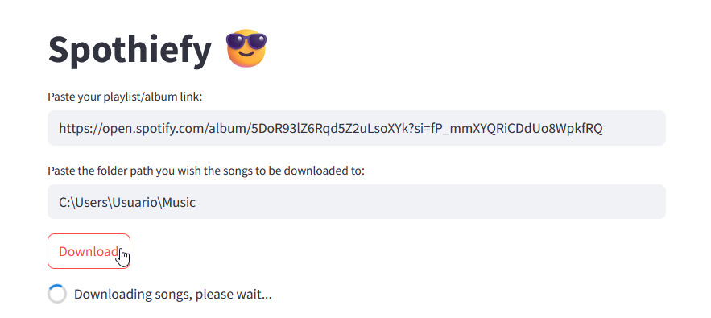

# SPOTHIEFY
Turn your Spotify playlists into mp3 files in an automated and easy way.

## Overview
Spothiefy is an application developed in Python using its library Selenium, which can automate web processes. Combining this with YT DLP, it becomes really easy and practical to download the songs listed on your favorite Spotify playlist.

## Set Up
1. **Clone the Repository**
```bash
git clone https://github.com/mateussimeao/spothiefy.git
cd spothiefy
```
2. **Create and activate the virtual environment**

On Windows:
```bash
python -m venv venv
venv\Scripts\activate
```
On MacOs/Linux:
```bash
python3 -m venv venv
source venv/bin/activate
```

3. **Install the Required Libraries**
```bash
pip install -r requirements.txt
```

4. **Download the Chrome WebDriver**
- Download the appropriate Chrome WebDriver for your Chrome version [here](https://developer.chrome.com/docs/chromedriver/downloads).

- Extract and paste the _chromedriver.exe_ file into the root folder of the project (the same folder where app.py is located).

5. **Run the Application**
```bash
streamlit run app.py
```

## How to Use It
1. **Paste your Spotify playlist URL and download directory path into the Link field.**
2. **Click "Download" and wait while your songs are automatically downloaded!**



## Common Issues
- If your playlist is way too long, it may not download all songs, since the scroll feature hasn't been applied to this project yet
